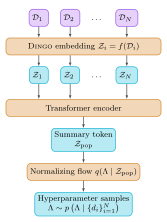
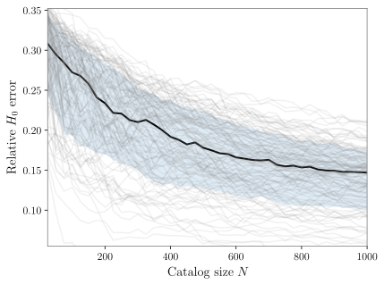

Happy to announce our [new paper](https://arxiv.org/abs/2605.11274) applying SBI to population inference. In this work (led by [Konstantin Leyde](https://www.simonsfoundation.org/people/konstantin-leyde/)) we use a transformer + normalizing flow to infer population parameters directly from a catalog of detector strain data. Our framework---called **DINGO-Pop**---bypasses the per-event parameter estimation step of traditional techniques, which removes a source of Monte Carlo error and results in an end-to-end inference time of about one second.

In the early days of GW astronomy, each individual observation was big news. But now that LIGO-Virgo-KAGRA have observed hundreds of events, some of the most interesting work is happening at the population level. By combining the entire catalog of detections, one can learn the astrophysical distribution of binaries and uncover their origin and evolution [@LIGOScientific:2025pvj].

### Hierarchical Bayesian analysis for populations

Population inference in gravitational-wave astronomy is built on hierarchical Bayesian analysis (HBA), which combines per-event posteriors into a posterior over the population properties $\Lambda$. This approach starts from the *population likelihood* [@Mandel:2018mve; @Fishbach:2018edt; @Vitale:2020aaz], which takes the form,
$$
p(\{\mathcal{D}_i\}_{i=1}^{N}\mid\Lambda) = \prod_{i=1}^{N} \frac{\int p(\mathcal{D}_i\mid \theta) p_\text{pop}(\theta \mid \Lambda)\,\mathrm{d}\theta}{\int p_\text{det}(\theta)\,p_\text{pop}(\theta\mid \Lambda)\, \mathrm{d}\theta},
$$
for the observed catalog $\{\mathcal D_i\}$ given the *population hyperparameters* $\Lambda$. ($\Lambda$ could denote, for instance, the power-law slope for the component masses.) Here, $\theta$ are the individual-event parameters (masses, spins, localization, and orientation).

In practice, both integrals are evaluated using [Monte Carlo integration](https://en.wikipedia.org/wiki/Monte_Carlo_integration):

1. For the numerator, start from individual-event PE samples. These are drawn under a fiducial PE prior $\pi(\theta)$, with the standard stationary-Gaussian GW likelihood, so that the posterior $p(\theta \mid \mathcal{D}_i) \propto p(\mathcal D_i \mid \theta) \pi(\theta)$. We then importance-reweight these samples to the population,
   $$
   \int p(\mathcal{D}_i\mid \theta) p_\text{pop}(\theta \mid \Lambda)\,\mathrm{d}\theta \approx \frac{p(\mathcal D_i)}{M}\sum_{j = 1}^M \frac{p_\mathrm{pop}(\theta_j \mid \Lambda)}{\pi(\theta_j)}.
   $$
   Here, the sum is over $M$ PE samples $\theta_j \sim p(\theta \mid \mathcal{D}_i)$. $p(\mathcal{D}_i)$ is independent of $\Lambda$, so we don't need to evaluate it to sample the population posterior.
2. The denominator accounts for selection effects, and is known as the *selection function*. The factor $p_\mathrm{det}(\theta)$ is the probability that an event with parameters $\theta$ is detected by the experiment. Not all mergers are detected, so the observed catalog is biased toward populations that produce more-detectable events; the denominator corrects for this. To calculate the integral, the standard approach is based on injections of simulated data sets into the detection pipeline.

As both of these integrals are performed using Monte Carlo methods, uncertainty is introduced due to the finite sample sizes. The variance in the log likelihood goes roughly as $N$ for the numerator and $N^2$ for the denominator [@Essick:2022ojx; @Talbot:2023pex; @Heinzel:2025ogf]. The upshot: keeping the variance fixed as catalogs grow means using more PE samples and more injections. This further increases the already-expensive costs of PE and injections.

There are several widely-used packages for HBA population inference, including [gwpopulation](https://github.com/colmtalbot/gwpopulation) and [icarogw](https://github.com/simone-mastrogiovanni/icarogw).

### End-to-end population inference with transformers

A few years ago, in work also led by Konstantin [@Leyde:2023iof], we applied SBI to populations to do neural posterior estimation over $\Lambda$. The idea was to simulate entire catalogs for training, including selection effects. The network thereby learns to account for them in the posterior. However, in that work, we still used PE samples as an intermediate step. We were also constrained by our network architecture to fixed catalog sizes. Even so, that work demonstrated that SBI for GW populations works and selection effects can be learned.

In DINGO-Pop, we go further and address the main bottlenecks of HBA---the high compute costs of single-event PE and the Monte Carlo noise. The idea is to do inference **end-to-end**: from raw strain data $\{\mathcal{D}_i\}_{i=1}^N$ directly to population posteriors $p(\Lambda \mid \{\mathcal{D}_i\}_{i=1}^N)$, with no intermediate per-event posterior. The key ingredients are:

Dingo-Pop pipeline: each event's strain \(\mathcal{D}_i\) is embedded by Dingo, the embeddings \(\mathcal{Z}_i\) are processed by a transformer encoder into a summary token \(\mathcal{Z}_\mathrm{pop}\), and a normalizing flow decodes population hyperparameters \(\Lambda\).

* **DINGO embeddings as tokens.** A pretrained Dingo encoder compresses each event's $\sim\!10^5$-dimensional strain into a 32-dim token $\mathcal{Z}_i$.
* **Transformer for aggregation.** Self-attention is permutation-invariant (matching the unordered nature of a catalog) and accommodates variable $N$ with a single network. A learnable summary token is prepended and read out as $\mathcal{Z}_\mathrm{pop}$.
* **Flow for density estimation.** A normalizing flow conditioned on $\mathcal{Z}_\mathrm{pop}$ samples the population hyperparameters.

The choice to use DINGO to compress event data is essentially a separation of roles. DINGO has already learned how to interpret raw GW data and generate single-event PE; this isn't a task that the population network should have to learn to do. The tokens $\mathcal Z_i$ are intermediate data representations used by DINGO for downstream PE---so they already contain all the information we need, in a form in which the parameters can be readily decoded. By using these, the DINGO-Pop network can focus on population-level inference.

Transformers, meanwhile, are a natural fit for population inference, since they take as input an arbitrary number of tokens (events). Along with the event tokens, we prepend a learnable "class token", and we pass all of these through a transformer encoder. In the end, we take only the class token as input to the flow, which is trained to learn the population posterior. The class token, therefore, learns a summary of the population through its attention paid to the event tokens. By training on catalogs of different sizes, the network learns how to accommodate variable $N$. When used without positional encodings, the network is also permutation-invariant by construction.

We also used transformers in DINGO-T1 for single-event inference [@Kofler:2025dux]. In that case, we partitioned the data stream into sub-segments and treated each of those as tokens. Since the ordering of sub-segments matters, we appended positional information (minimum and maximum frequencies and the observing interferometer). However for populations, the ordering is irrelevant, and we want the answer to be permutation invariant, so we omit any positional encoding.

#### Note on training

Generating entire populations for training---sampling hyperparameters, sampling event parameters, generating waveforms, adding noise---is expensive. Additionally, selecting only the events that are observed means that many (most!) waveforms generated are never seen by the population network. To speed this up and make training feasible in practice, we had to generate data directly in the embedding space of observed events. As we describe in our paper, we trained auxiliary neural networks to help with this.

### Results

We trained a single DINGO-Pop model covering catalog sizes ranging from $N=25$ to $1000$, assuming a power-law + peak mass distribution and allowing for variable Hubble constant (nine hyperparameters total). Inference takes about one second per catalog, so we can afford to do detailed injection studies to validate performance and make predictions. This included a probability--probability plot based on 2,500 catalog analyses to verify posterior calibration. We also showed consistency with HBA to within Monte Carlo uncertainty.

Inference this fast opens up many applications. Here, we looked at how the uncertainty in the measurement of the Hubble constant varies with catalog size. Such studies enable detailed predictions for future observations---but the costs were completely prohibitive until now.

Spectral-siren Hubble constant relative error as a function of catalog size. We simulated 128 independent populations, and for each one varied the catalog size between 25 and 1000. Median uncertainty falls from about 30% to 15% over this range.

### Next steps

We'd like to apply this next to real data. The key issue for now is extending the DINGO embedding network to cover the full parameter space of LVK observations, since right now it covers a somewhat restricted prior. We'd also like to extend to much larger catalog sizes suitable for next-generation detectors.

For more on our SBI program, see the [research page](/research/sbi/).
