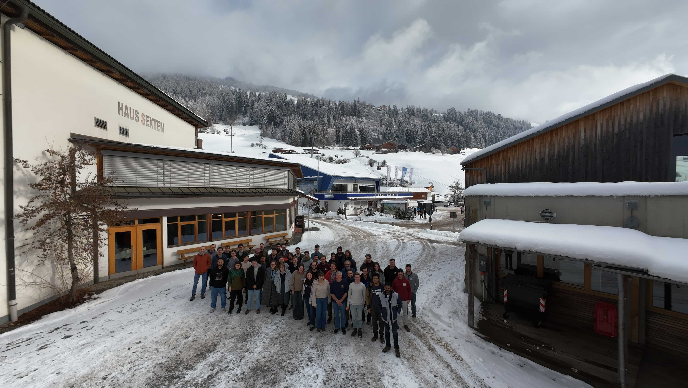

In January 2026 we held [GWFreeride: Carving the AI Gradient in Gravitational-Wave Astronomy](https://sites.google.com/unimib.it/gwfreeride), a workshop at the Sexten Center for Astrophysics in the Italian Dolomites.

The workshop brought together researchers in AI and gravitational-wave astronomy to map out challenges and opportunities for the coming decade. Topics included simulation-based inference, waveform modeling with neural networks, population inference, the LISA global fit, non-Gaussian noise mitigation, and data analysis strategies for next-generation observatories like the Einstein Telescope and Cosmic Explorer.

The meeting was organized by myself, [Davide Gerosa](https://davidegerosa.com/) (Milano-Bicocca), [Max Dax](https://max-dax.github.io/) (Ellis Institute), and Natalia Korsakova, with the support of the [Sexten Center for Astrophysics](https://www.sexten-cfa.eu/).
