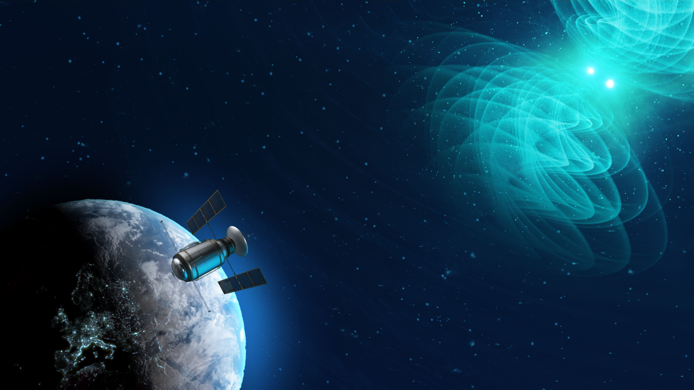
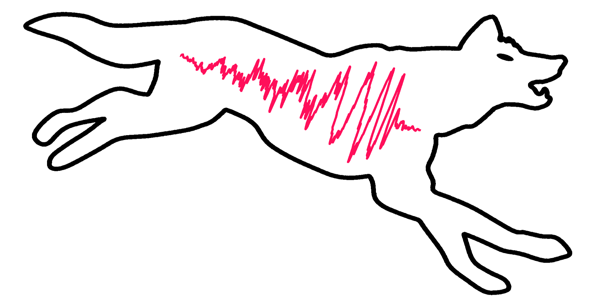

::: {.hero-band}
::: {.hero-home}

::: {.hero-grid}

::: {.hero-photo-col}
::: {.hero-photo-wrap}

:::

::: {.hero-links}
[](https://github.com/)
[](https://bsky.app/profile/)
[](https://scholar.google.com/citations?user=&hl=en)
[](https://inspirehep.net/authors/)
[](https://orcid.org/)
[](https://www.linkedin.com/in/)
[](mailto:)
:::
:::

::: {.hero-text-col}

# Stephen Green

::: {.hero-subtitle}
Principal Research Fellow &middot; University of Nottingham
:::

I develop machine learning methods for gravitational-wave astronomy, supported by a [UKRI Future Leaders Fellowship](https://www.ukri.org/news/68-new-future-leaders-fellows-awarded-104-million-in-the-eighth-round/). My group develops simulation-based inference methods for gravitational-wave data analysis, from parameter estimation to population studies. I also work on black hole perturbation theory, motivated by waveform modelling and foundational questions in general relativity.

Previously I was at the Max Planck Institute for Gravitational Physics (AEI), the Perimeter Institute, and a CITA National Fellow at Guelph. I did my PhD at the University of Chicago with Robert Wald.

:::

:::

:::
:::

::: {.home-band}
::: {.home-content}

::: {.section-label}
Featured
:::

::: {.featured-pub-block}

::: {.featured-pub-image}

:::

::: {.featured-pub-body}

::: {.pub-journal}
Nature &middot; 2025
:::

### Real-time inference for binary neutron star mergers using machine learning

::: {.pub-summary}
Led by Max Dax, this work demonstrates that neural posterior estimation can enable one-second inference for binary neutron star mergers --- complete parameter estimation including sky localization, crucial for multimessenger astronomy.
:::

::: {.pub-links}
[Read article](https://doi.org/10.1038/s41586-025-08593-z){.btn .btn-primary .btn-sm .me-2}
[arXiv](https://arxiv.org/abs/2307.12585){.btn .btn-outline-primary .btn-sm}
:::

:::

:::

::: {.section-rule}
:::

::: {.featured-pub-block}

::: {.featured-pub-image}

:::

::: {.featured-pub-body}

::: {.pub-journal}
Invited Talk &middot; 2025
:::

### AI/ML for Gravitational-Wave Data Analysis

::: {.pub-summary}
The Future of Gravitational-Wave Astronomy, ICTS Bangalore
:::

::: {.pub-links}
[Watch talk](https://www.youtube.com/watch?v=gl5DchHeQF0){.btn .btn-primary .btn-sm}
:::

:::

:::

:::
:::

::: {.home-band .home-band--warm}
::: {.home-content}

::: {.grid}

::: {.g-col-12 .g-col-md-7}

::: {.section-label}
Research
:::

::: {.research-preview}
### [Machine Learning for Gravitational Waves](research/sbi/)

Simulation-based inference for gravitational-wave parameter estimation. Our [Dingo](https://github.com/dingo-gw/dingo) framework produces full posterior distributions in seconds --- a $10^4\times$ speedup --- and has revealed the first evidence for eccentric binary black holes.

[Read more &rarr;](research/sbi/){.read-more}
:::

::: {.research-preview}
### [Classical Gravity](research/gravity/)

New methods for black hole perturbation theory, including metric reconstruction and quasinormal mode orthogonality, with applications to LISA sources. Earlier work uncovered gravitational turbulence in anti-de Sitter spacetime and ruled out cosmological backreaction as an alternative to dark energy.

[Read more &rarr;](research/gravity/){.read-more}
:::

:::

::: {.g-col-12 .g-col-md-5}

::: {.section-label}
News
:::

:::{#home-news}
:::

[View all &rarr;](/blog/){.view-all}

:::

:::

:::
:::

::: {.home-band}
::: {.home-content}

::: {.section-label}
Software
:::

::: {.software-block}

::: {.software-logo}

:::

::: {.software-body}
**Dingo** --- Deep Inference for Gravitational-wave Observations. Open-source simulation-based inference for gravitational waves, developed for use by the LIGO-Virgo-KAGRA collaboration.

::: {.software-links}
[ GitHub](https://github.com/dingo-gw/dingo){.me-3}
[Trained Networks](https://zenodo.org/communities/dingo-gw/records)
:::

:::

:::

:::
:::

::: {.home-band}
::: {.home-content}

::: {.section-label}
Contact
:::

::: {.contact-grid}

::: {.contact-text}
 [](mailto:)\
 

 B25 Mathematical Sciences Building\
School of Mathematical Sciences\
University of Nottingham
:::

::: {.contact-map}
<iframe src="https://www.google.com/maps/embed?pb=!1m18!1m12!1m3!1d2404.5!2d-1.1920771!3d52.9405891!2m3!1f0!2f0!3f0!3m2!1i1024!2i768!4f13.1!3m3!1m2!1s0x4879c20ed7e1d009%3A0xb1e4e36bf6f82fd!2sSchool%20of%20Mathematical%20Sciences!5e0!3m2!1sen!2suk!4v1" width="100%" height="200" style="border:0; border-radius: 4px;" allowfullscreen="" loading="lazy" referrerpolicy="no-referrer-when-downgrade"></iframe>
:::

:::

:::
:::

