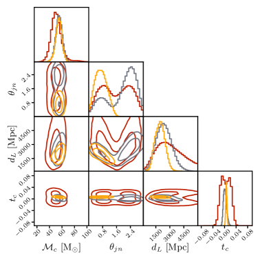
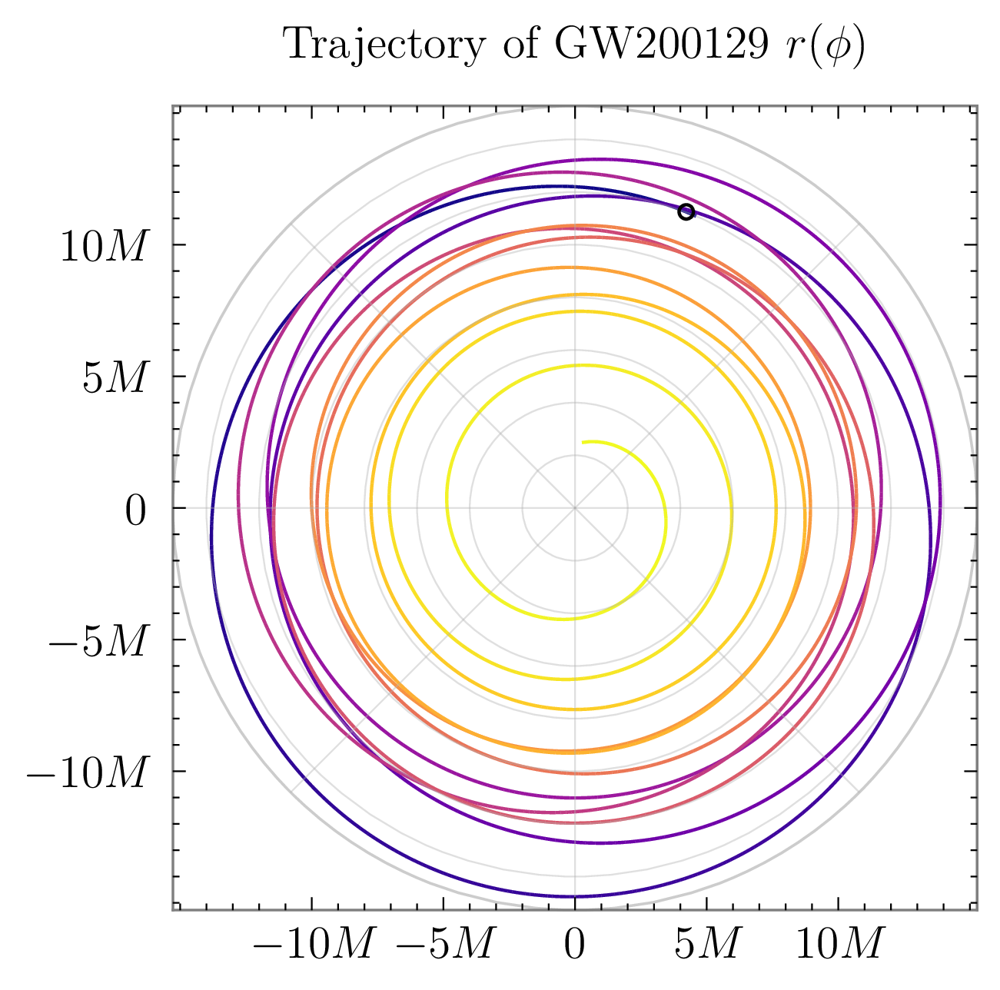
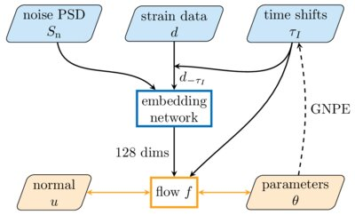
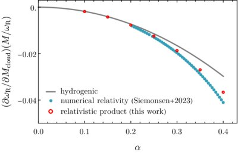
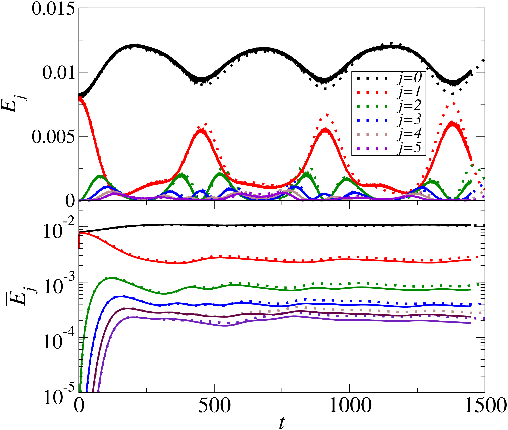

## Highlights

:::: {.pub-row}
::: {.pub-highlight key="Kofler:2025dux"}
A. Kofler et al. Transformer-based architecture for gravitational-wave inference that generalizes across detector networks and frequency ranges without retraining, with strong performance and a foundation for further flexibility.
:::

::: {.pub-img}

:::
::::

:::: {.pub-row}
::: {.pub-highlight key="Gupte:2024jfe"}
N. Gupte et al. Amortized SBI analysis of all O1--O3 events reveals evidence for orbital eccentricity in three binary black holes.
:::

::: {.pub-img}

:::
::::

:::: {.pub-row}
::: {.pub-highlight key="Dax:2021tsq"}
M. Dax et al. First neural posterior estimation for real gravitational-wave events amortized across noise PSDs, achieving results in seconds.
:::

::: {.pub-img}

:::
::::

:::: {.pub-row}
::: {.pub-highlight key="Green:2022htq"}
S. Green, S. Hollands, and P. Zimmerman. Construction of conserved bilinear form for the Teukolsky equation, proving QNM orthogonality for Kerr black holes.
:::

::: {.pub-eq}
$$\langle\langle\Upsilon_1,\Upsilon_2\rangle\rangle = \Pi_{\Sigma_{\mathbb{C}}}[\Psi_2^{4/3}\mathcal{J}\Upsilon_1,\Upsilon_2]$$

$$c_{\ell mn} = \frac{\langle\langle {}_s\Upsilon_{\ell mn},\Upsilon_s\rangle\rangle}{\langle\langle {}_s\Upsilon_{\ell mn},{}_s\Upsilon_{\ell mn}\rangle\rangle}$$
:::
::::

<!-- :::: {.pub-row}
::: {.pub-highlight key="Cannizzaro:2023jle"}
E. Cannizzaro, L. Sberna, S. Green, and S. Hollands. Application of QNM perturbation theory to compute frequency shifts from massive scalar boson clouds.
:::

::: {.pub-img}

:::
:::: -->

:::: {.pub-row}
::: {.pub-highlight key="Balasubramanian:2014cja"}
Discovery of Fermi-Pasta-Ulam recurrence behavior in the nonlinear dynamics of anti-de Sitter spacetime. Led to improved understanding of AdS instability.
:::

::: {.pub-img}

:::
::::

:::: {.pub-row}
::: {.pub-highlight key="Green:2010qy"}
S. Green and R. Wald. A rigorous framework for analyzing the effects of small-scale inhomogeneities in cosmology, showing that backreaction cannot mimic dark energy.
:::
::::

## Bibliography

::: {.callout-note appearance="simple"}
Short-author-list publications only. For LVK collaboration papers, see [INSPIRE](https://inspirehep.net/authors/1073848) and [Google Scholar](https://scholar.google.com/citations?user=sqvBC1wAAAAJ&hl=en).
:::

