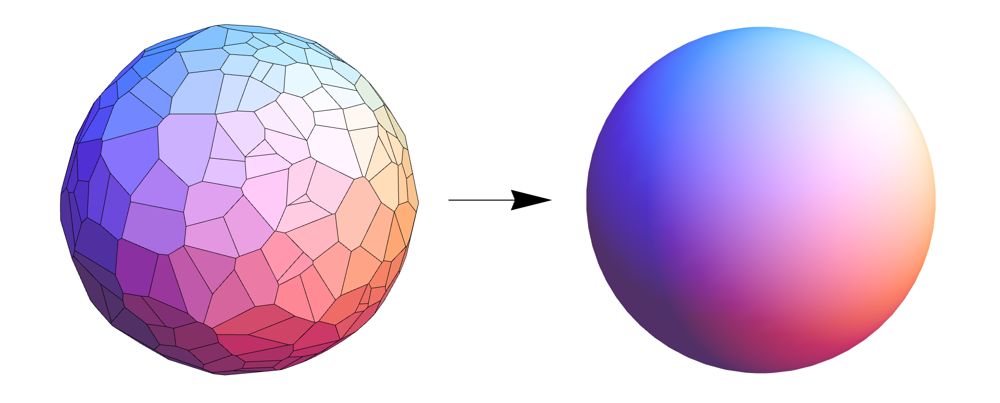

Accurate theoretical predictions for gravitational waves are essential for extracting the most physics from observations. My work in theoretical gravitational physics is in black hole perturbation theory, and aims to make better predictions for the ringdown phase following a merger. I have also worked on nonlinear dynamics in anti-de Sitter spacetime and relativistic cosmology.

## Black Hole Perturbation Theory

In several astrophysically relevant scenarios, one can treat spacetime as a small deviation away from the [Kerr solution](https://en.wikipedia.org/wiki/Kerr_metric) for a stationary rotating black hole. For an extreme mass-ratio inspiral, for instance, where a small body spirals into a massive black hole, one can treat the small body as a perturbation about the massive Kerr black hole. Likewise, following a merger of roughly equal-mass black holes, the final remnant black hole is well-described as a perturbation away from Kerr. Here, the final black hole rings down until it is stationary, and for much of its evolution is described by [quasinormal modes](https://en.wikipedia.org/wiki/Quasinormal_mode)---with characteristic frequencies that depend only on the mass and spin of the object. Much of my work is motivated by trying to extend perturbation theory beyond linear order.

### Teukolsky formalism for nonlinear perturbations

Because we are dealing with a spin-2 field, perturbation theory in general relativity is in general quite complicated. However, for perturbations of Kerr, the problem reduces to that of a single complex scalar field $\psi$ (a curvature scalar), which satisfies a *separable* wave equation, $\mathcal O(\psi)=0$. This discovery by Teukolsky is based on hidden symmetries of the Kerr spacetime.

Remarkably, in vacuum, solutions for the metric perturbation can be obtained from solutions for the curvature scalar, using a method involving a Hertz potential. However, in the presence of sources, this method breaks down, and one must treat the metric perturbation directly. Since second-order perturbations are sourced nonlinearly by first order perturbations, the Teukolsky framework cannot be used to simplify second order calculations.

::: {.column-margin}
![Particle orbiting a Kerr black hole. The corrector tensor $x_{ab}$ is nonzero on the strings emanating from the particle to infinity [@Green:2019nam].](particle.png){.lightbox}
:::

With S. Hollands and P. Zimmerman, we found a method to obtain the metric perturbation from the curvature scalar *even in the presence of sources* [@Green:2019nam]. It requires the introduction of a corrector tensor $x_{ab}$, which disposes of the problematic source terms and which can be calculated by solving ordinary differential equations. Subsequently, with V. Toomani, P. Zimmerman, and S. Hollands, we developed a complete metric reconstruction scheme for self-force calculations [@Toomani:2021jlo], combining the corrector tensor with CCK reconstruction in radiation gauge.

### Quasinormal mode orthogonality

Quasinormal modes describe how black holes ring down after being perturbed. They are described by complex frequencies $\omega_\mathrm{QNM} = \omega_R + i \omega_I$, with the real part describing oscillations and the imaginary part decay (or growth, in the case of an instability). The decay arises because the system is dissipative (energy is lost as it passes through the horizon and away to infinity) and therefore the spectral theorem does not apply to give rise to real frequencies or to guarantee an orthonormal set of modes. The radial functions of quasinormal modes also tend to explode at the bifurcation surface and spatial infinity. For these reasons, it is not straightforward to use quasinormal modes as fundamental objects in perturbation theory (as one might do for normal modes).

Motivated by these questions, my collaborators and I showed that under an appropriate scalar product, quasinormal modes do in fact become orthogonal. We constructed conserved currents (based on the symplectic current) for the Teukolsky equation that yield a well-defined bilinear form, and proved that QNMs of Kerr are orthogonal with respect to it [@Green:2022htq]. This provides the foundation for a perturbation theory of black holes, analogous to how normal mode orthogonality underpins quantum mechanics and other areas of wave physics.

### Applications: Boson clouds and nonlinear ringdown

* With E. Cannizzaro, L. Sberna, and S. Hollands, we applied this perturbation theory to compute how a massive scalar boson cloud around a Kerr black hole modifies QNM frequencies [@Cannizzaro:2023jle]. Follow-up work examined the excitation of scalar QNMs from boson clouds [@Cannizzaro:2025vpb].
* We studied nonlinear effects in the black hole ringdown, showing that absorption of one QNM can excite others by shifting the background solution [@Sberna:2021eui].
* In work led by C. Iuliano and S. Hollands, we showed that for near-extreme Kerr, interactions between long-lived quasinormal modes can exhibit turbulent cascade-like behavior [@Iuliano:2024ogr]. This was one of the main motivating questions that led us to develop the metric reconstruction and mode orthogonality in the first place.

## Dynamics in Anti-de Sitter Spacetime

In standard astrophysical contexts, gravitational waves propagate away from a source at the speed of light. But in some special geometries, waves are confined and cannot escape. This gives them time to grow through nonlinear interactions and can lead to interesting behaviors. [Anti-de Sitter (AdS)](https://en.wikipedia.org/wiki/Anti-de_Sitter_space) spacetime --- a maximally symmetric spacetime that lies at the heart of the [AdS-CFT correspondence](https://en.wikipedia.org/wiki/AdS/CFT_correspondence) --- is an excellent example of a geometry that has this confining effect.

### Instability of anti-de Sitter

With A. Buchel, L. Lehner, and S. Liebling, we studied perturbations of global anti-de Sitter spacetime. This spacetime is completely confining --- there is no dissipation --- and had therefore been conjectured to be unstable to small perturbations. Numerical evidence also showed that tiny perturbations would grow through nonlinear interactions to become very large, eventually forming a black hole [@Bizon:2011gg]. The question is whether *arbitrarily small* perturbations always collapse? Are there special perturbations that don't?

These questions cannot be addressed through numerical simulations, so we applied two-timescale perturbation theory: we found a way to "average" out typical wave oscillations, and analyze separately the nonlinear energy flows between wave modes [@Balasubramanian:2014cja]. Using this, we found surprising connections between the AdS stability problem and the old [Fermi-Pasta-Ulam-Tsingou problem](https://en.wikipedia.org/wiki/Fermi–Pasta–Ulam–Tsingou_problem) of ergodic versus periodic behavior for nonlinearly coupled harmonic oscillators.

Applying techniques from nonlinear dynamics, we identified a new approximate conservation law for this system ("wave action") [@Buchel:2014xwa] and we showed that there exist "islands of stability" where initial data do not appear to lead to collapse [@Green:2015dsa]. More recent work by mathematicians has confirmed the instability of AdS for certain types of matter fields [@Moschidis:2017llu; @Moschidis:2018ruk].

### Spacetime turbulence

When large AdS black holes are perturbed, they ring down very slowly, i.e., they have long-lived quasinormal modes. This behavior has been associated with the hydrodynamic modes of a fluid in one lower dimension, an observation that gave rise to the "gravity/fluid correspondence." An immediate question arises: since fluids can become turbulent, can this happen in the gravitational field?

::: {.column-margin}
![Turbulent gravitational waves around a large AdS black hole [@Green:2013zba].](turbulence.jpg){.lightbox}
:::

With F. Carrasco and L. Lehner, we studied this ringdown numerically by exploiting this correspondence between the spacetime metric and the fluid [@Green:2013zba]. We considered a relativistic viscous fluid in $(2+1)$-dimensional flat spacetime, which is dual to a black hole in $3+1$ dimensions. We showed that under evolution, the fluid develops turbulent vortices and eddies, and that there are dual cascades of energy and enstrophy. We extrapolated these results into the black hole spacetime and verified that they matched direct gravitational studies.

This research motivated later work proposing that even *asymptotically flat* black holes might go turbulent --- provided they are nearly extremally spinning [@Yang:2014tla]. Indeed, near-extreme Kerr has a set of *zero-damped modes* which become arbitrarily long lived as the spin $a\to M$. Finally, in 2025, in work led by S. Hollands and his student C. Iuliano, we found evidence for turbulent cascades near extremality [@Iuliano:2024ogr]. This work involved combining metric reconstruction [@Green:2019nam] together with quasi-normal mode orthogonality [@Green:2022htq] to express the modes as a coupled nonlinear system.

### Superradiant instabilities

If a black hole has charge or angular momentum, then it is possible to extract mass from the black hole via superradiant scattering: if a suitably tuned wave falls into the black hole, it is amplified rather than absorbed. Although mass may be carried away from the black hole in this process, the black hole area always increases, as demanded by the area theorem.

If superradiant amplification were confined in a region surrounded by a mirror, then after the wave is amplified, it propagates out to the mirror, and is reflected back to the black hole to be scattered and amplified again. This process repeats, with the amplitude of the wave growing exponentially, giving rise to a superradiant *instability* or black hole bomb. The end point of the instability is an important question for general relativity: if the black hole is destroyed in the process this could represent a violation of cosmic censorship. Astrophysically, the superradiant instability has been proposed as a way to search for ultralight scalar fields, which are potential dark matter candidates.

Anti-de Sitter spacetime provides a naturally reflecting boundary at infinity, and thus a natural setting for studying the superradiant instability:

* With S. Hollands, A. Ishibashi and R. Wald, I proved that all asymptotically AdS black holes with an "ergoregion" are subject to the instability --- a very general result [@Green:2015kur].

* With P. Bosch and L. Lehner, I performed numerical simulations of the superradiant instability of Reissner-Nordström AdS black holes, showing the full nonlinear development of the instability [@Bosch:2016vcp]. We studied the behavior of individual resonant modes, and uncovered an intricate sequence of growth and decay, until the final state (a "hairy black hole") is reached.

## Backreaction in Cosmology

Although the universe is homogeneous and isotropic at large cosmological scales, density perturbations can be very large at small scales (e.g., galaxies, stars, etc.). When passing from the small scale description, where Einstein's equation holds, to the large scale description, some sort of averaging is necessary. This is nontrivial because the Einstein equation is nonlinear, so that small scale structure can potentially affect the large scale dynamics. It has even been suggested that such effects could mimic a cosmological constant.

With R. Wald, I developed a framework [@Green:2010qy] in which such "backreaction" effects could be calculated, and proved that the only way in which significant effects could occur is via gravitational radiation, thus ruling this scenario out as an explanation for dark energy. We then used this framework to establish a perturbative relationship between Newtonian and relativistic cosmology [@Green:2011wc].

Our work on backreaction was controversial in certain communities, leading to heated discussions on the arXiv (see [@Buchert:2015iva] and our reply [@Green:2015bma]). In [@Green:2016cwo] we summarize our approach, and argue that the key point is that the universe should be viewed at the level of the metric, *not* the curvature. At the level of metric perturbations, the universe is homogeneous to one part in $10^4$ except near strong field objects like black holes. We prove general results that such inhomogeneities cannot lead to significant backreaction.

See the [publications page](/publications/) for a full list of papers.

{.lightbox}
