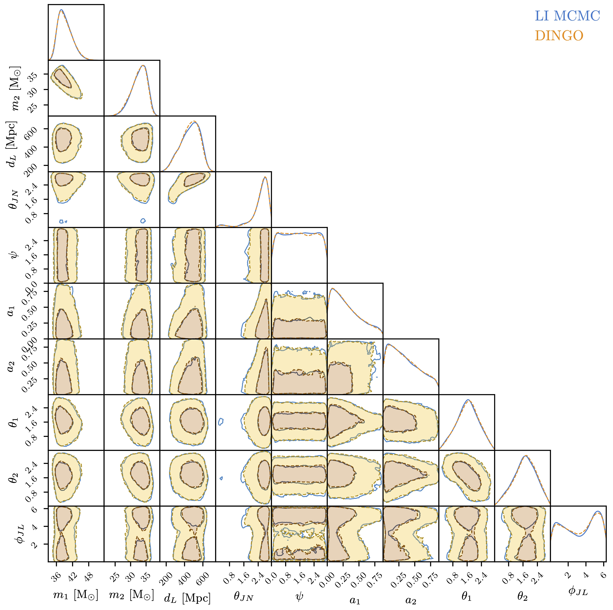
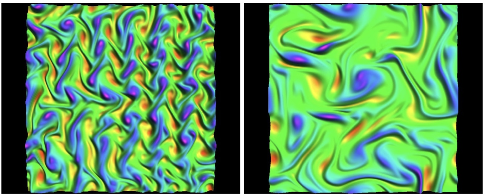

My research spans machine learning for gravitational-wave astronomy and foundational problems in classical general relativity.

My group's main focus is developing **simulation-based inference** methods for gravitational-wave data analysis, enabling real-time parameter estimation with neural networks. In **classical gravity**, I have worked on several distinct problems: black hole perturbation theory — where recent results on quasinormal mode orthogonality connect to gravitational-wave modelling — as well as the nonlinear dynamics of anti-de Sitter spacetime and the cosmological backreaction problem.

See also the [research group](/team/) and [publications](/publications/).

::: {.research-area}

### [Machine Learning for Gravitational Waves](sbi/)

::: {.research-area-content}

::: {.research-area-image}

:::

Gravitational-wave detectors are observing an accelerating number of black hole and neutron star mergers, and extracting the physics from each event requires computationally intensive Bayesian inference. We develop **simulation-based inference** methods that train neural networks to directly learn the posterior distribution from simulated data, bypassing the likelihood entirely.

Our open-source code [**Dingo**](https://github.com/dingo-gw/dingo) produces full posterior distributions in seconds --- a speedup of $10^4$--$10^5$ over traditional samplers --- and has been applied to all events from the first three LIGO-Virgo observing runs, including [binary neutron star mergers](https://doi.org/10.1038/s41586-025-08593-z) (Nature, 2025).

[Read more &rarr;](sbi/){.read-more}

:::
:::

::: {.research-area}

### [Classical Gravity](gravity/)

::: {.research-area-content}

::: {.research-area-image}

:::

With S. Hollands and others, we developed new methods for [metric reconstruction in Kerr spacetime](https://arxiv.org/abs/1908.09095) and proved the [orthogonality of quasinormal modes](https://arxiv.org/abs/2210.15935), with applications to [boson clouds](https://doi.org/10.1103/PhysRevLett.132.051401) (PRL) and [nonlinear ringdown](https://arxiv.org/abs/2112.11168). In anti-de Sitter spacetime, we discovered [gravitational turbulence](https://arxiv.org/abs/1309.7940) and identified [islands of stability](https://arxiv.org/abs/1504.04161) amid generic nonlinear instability. With R. Wald, we established a rigorous [backreaction framework](https://arxiv.org/abs/1407.8084) ruling out large-scale effects from cosmological inhomogeneities.

[Read more &rarr;](gravity/){.read-more}

:::
:::
