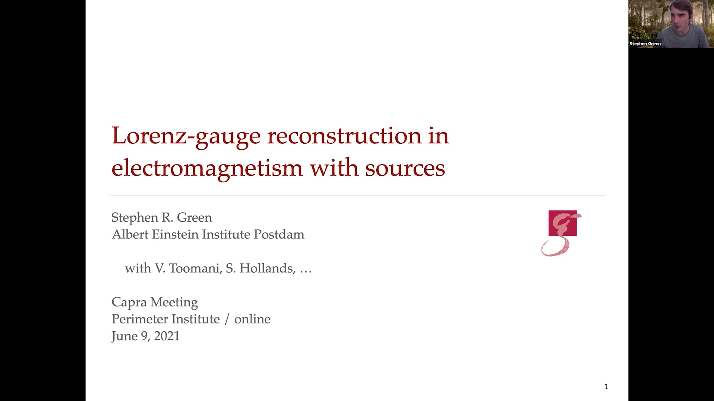

Over 80 presentations at venues including ICTS Bangalore, IPAM UCLA, the Lorentz Center, and the Niels Bohr Institute. Below is a selection of recorded talks; see my [CV](/cv/) for the full list.

## Selected Recorded Talks

::: {.talk-grid}

::: {.talk-card}
[{.talk-thumb}](https://youtu.be/gl5DchHeQF0)

::: {.talk-card-body}
::: {.talk-meta}
Invited Talk &middot; 2025
:::
**[AI/ML for Gravitational-Wave Data Analysis](https://youtu.be/gl5DchHeQF0)**

The Future of Gravitational-Wave Astronomy, ICTS Bangalore
:::
:::

::: {.talk-card}
[{.talk-thumb}](https://brown.hosted.panopto.com/Panopto/Pages/Viewer.aspx?id=edf1cbaa-bbad-479a-9919-b2e600fd881f)

::: {.talk-card-body}
::: {.talk-meta}
Invited Talk &middot; 2025
:::
**[Neural Posterior Estimation for GW Inference](https://brown.hosted.panopto.com/Panopto/Pages/Viewer.aspx?id=edf1cbaa-bbad-479a-9919-b2e600fd881f)**

Workshop on Scientific ML for GW Astronomy, ICERM, Brown University

[Slides (PDF)](https://app.icerm.brown.edu/assets/524/9108/9108_5239_Green_060420251100_Slides.pdf){.talk-slides-link}
:::
:::

::: {.talk-card}
[{.talk-thumb}](https://youtu.be/XN9DNp5fTn8)

::: {.talk-card-body}
::: {.talk-meta}
Keynote Talk &middot; 2022
:::
**[Simulation-Based Inference for Gravitational Waves](https://youtu.be/XN9DNp5fTn8)**

Bayesian Deep Learning for Cosmology, APC Paris

[Slides (PDF)](https://indico.in2p3.fr/event/26887/contributions/111734/attachments/71719/102177/apc-2022-b.pdf){.talk-slides-link}
:::
:::

::: {.talk-card}
[{.talk-thumb}](https://www.youtube.com/watch?v=SzWH2Xd2jEA)

::: {.talk-card-body}
::: {.talk-meta}
Invited Talk &middot; 2021
:::
**[Real-time GW Parameter Estimation Using Machine Learning](https://www.youtube.com/watch?v=SzWH2Xd2jEA)**

Source Inference and PE in GW Astronomy, IPAM UCLA

[Slides (PDF)](http://helper.ipam.ucla.edu/publications/gwaws3/gwaws3_17049.pdf){.talk-slides-link}
:::
:::

::: {.talk-card}
[{.talk-thumb}](https://pirsa.org/21060044)

::: {.talk-card-body}
::: {.talk-meta}
Conference Talk &middot; 2021
:::
**[Lorenz-Gauge Reconstruction for Teukolsky Solutions with Sources](https://pirsa.org/21060044)**

24th Capra Meeting, Perimeter Institute
:::
:::

::: {.talk-card}
[{.talk-thumb}](https://www.youtube.com/watch?v=HB-Rw5kRUfg&t=2967s)

::: {.talk-card-body}
::: {.talk-meta}
Conference Talk &middot; 2020
:::
**[Teukolsky Formalism for Nonlinear Kerr Perturbations](https://www.youtube.com/watch?v=HB-Rw5kRUfg&t=2967s)**

23rd Capra Meeting, UT Austin
:::
:::

:::

## Lecture Series & Schools

::: {.talk-entry}
::: {.talk-meta}
Lecturer &middot; 2023
:::

### Machine Learning for Gravitational Waves

Kavli-Villum Summer School on Gravitational Waves, Corfu, Greece
:::

::: {.talk-entry}
::: {.talk-meta}
Lecturer &middot; 2022
:::

### GW Parameter Estimation with Bayesian Machine Learning

LISA Data Analysis School, Toulouse, France
:::

::: {.talk-entry}
::: {.talk-meta}
Lecturer &middot; 2021
:::

### [Machine Learning for GW Data Analysis](https://imprs-gw-lectures.aei.mpg.de/2021-making-sense-of-data/week-4/)

IMPRS Course on Statistics for GW Astronomy, AEI

::: {.talk-links}
[ Recordings & Slides](https://imprs-gw-lectures.aei.mpg.de/2021-making-sense-of-data/week-4/)
:::
:::

