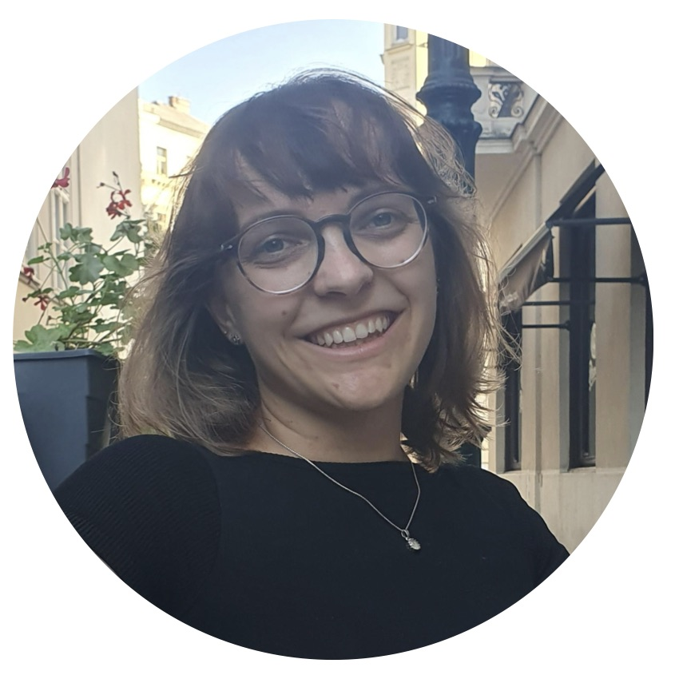

Our research group works on gravitational waves, machine learning for science, and theoretical gravity, in close collaboration with computer scientists at the [Max Planck Institute for Intelligent Systems](https://is.mpg.de/) and the [Max Planck Institute for Gravitational Physics (AEI)](https://www.aei.mpg.de/).

## Current Group

::: {.grid .gap-4}

::: {.g-col-12 .g-col-md-6 .g-col-lg-4}
::: {.team-card}

::: {.team-name}
Stephen Green
:::
::: {.team-role .team-role--pi}
Principal Investigator
:::
::: {.team-meta}
UKRI Future Leaders Fellow
:::
:::
:::

::: {.g-col-12 .g-col-md-6 .g-col-lg-4}
::: {.team-card}

AG

::: {.team-name}
Alexandre Göttel
:::
::: {.team-role .team-role--postdoc}
Postdoctoral Researcher
:::
::: {.team-desc}
GW data analysis, simulation-based inference, dark matter searches with LIGO.
:::
:::
:::

::: {.g-col-12 .g-col-md-6 .g-col-lg-4}
::: {.team-card}

LP

::: {.team-name}
[Lorenzo Pompili](https://lorenzopompili00.github.io/)
:::
::: {.team-role .team-role--postdoc}
Postdoctoral Researcher
:::
::: {.team-desc}
Waveform modeling (effective-one-body), tests of general relativity.
:::
:::
:::

::: {.g-col-12 .g-col-md-6 .g-col-lg-4}
::: {.team-card}

MM

::: {.team-name}
[Matthew Mould](https://www.mattmould.com/)
:::
::: {.team-role .team-role--fellow}
1851 Research Fellow
:::
::: {.team-desc}
GW population inference, machine learning for black hole formation.
:::
:::
:::

::: {.g-col-12 .g-col-md-6 .g-col-lg-4}
::: {.team-card}

::: {.team-name}
Jacopo Lestingi
:::
::: {.team-role .team-role--phd}
PhD Student
:::
::: {.team-desc}
BH perturbation theory in GR and alternatives. Emphasis on quasinormal modes and asymmetric compact objects.
:::
:::
:::

::: {.g-col-12 .g-col-md-6 .g-col-lg-4}
::: {.team-card}

AR

::: {.team-name}
Alex Roussopoulos
:::
::: {.team-role .team-role--phd}
PhD Student
:::
::: {.team-desc}
SBI for environmental effects in binary mergers.
:::
:::
:::

::: {.g-col-12 .g-col-md-6 .g-col-lg-4}
::: {.team-card}

CF

::: {.team-name}
Cecilia Fabbri
:::
::: {.team-role .team-role--phd}
PhD Student
:::
::: {.team-desc}
Population inference and simulation-based inference for gravitational waves.
:::
:::
:::

:::

## Affiliated Students

PhD students based at partner institutes whom I co-supervise and work with closely on a day-to-day basis.

::: {.grid .gap-4}

::: {.g-col-12 .g-col-md-6 .g-col-lg-4}
::: {.team-card}

::: {.team-name}
[Annalena Kofler](https://www.annalenakofler.com)
:::
::: {.team-role .team-role--phd}
PhD Student
:::
::: {.team-meta}
MPI for Intelligent Systems, Tübingen
:::
::: {.team-desc}
Advanced architectures, scaling, and flexible networks.
:::
:::
:::

:::

## Join Us

We are looking for motivated researchers at all levels. If you are interested in gravitational waves or machine learning, please get in touch. We regularly have openings for:

- **Postdoctoral Fellowships**
- **PhD Students**
- **Visiting Researchers**

For current opportunities, check the [latest news](/blog/) or contact [Dr. Stephen Green](mailto:stephen.green2@nottingham.ac.uk) directly.
