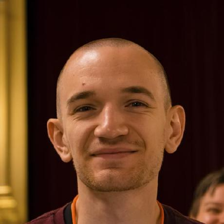
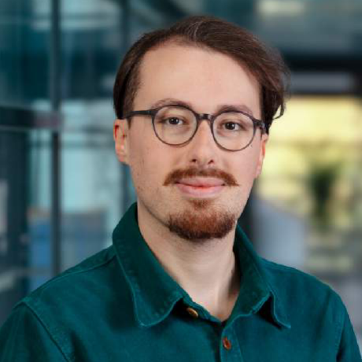
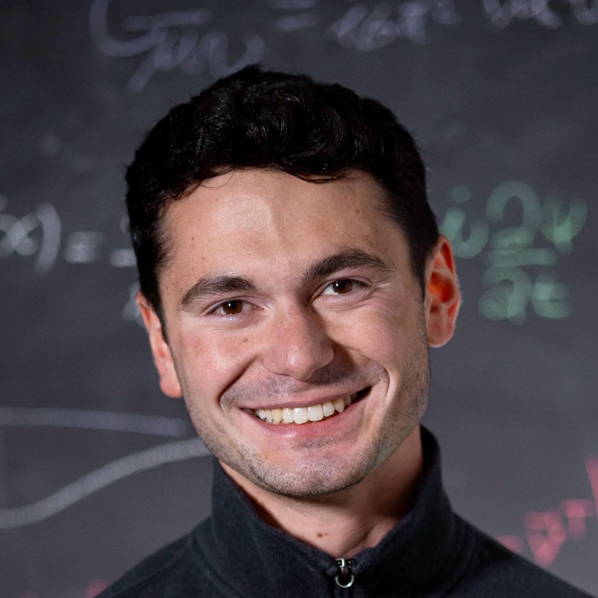
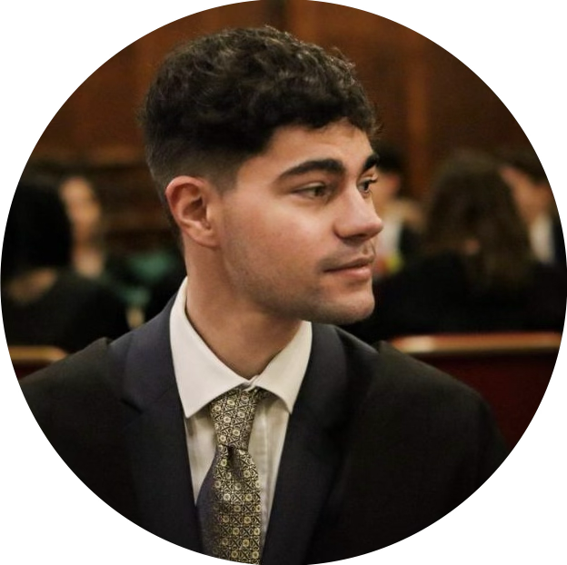
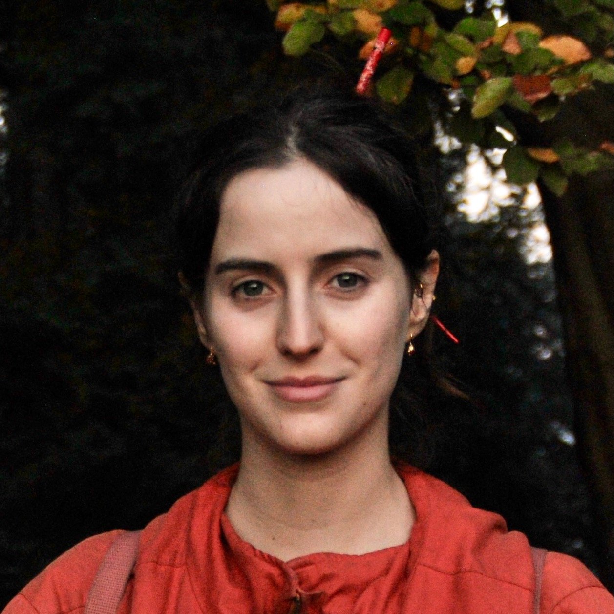
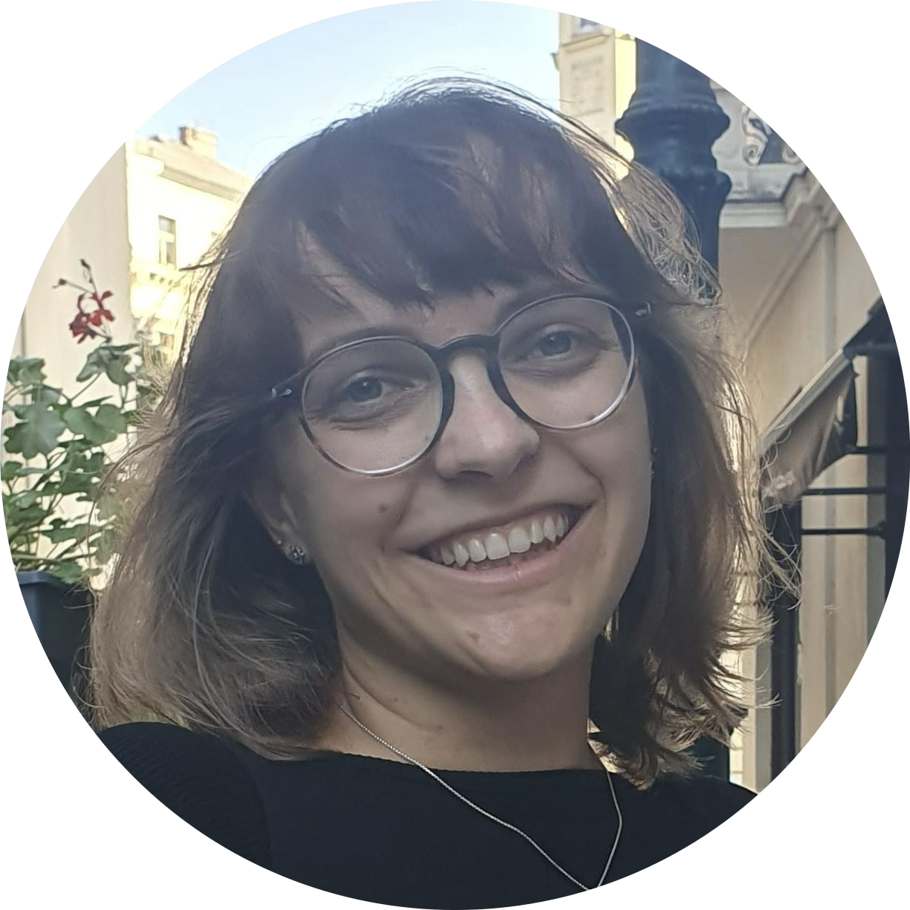

Our research group works on gravitational waves, machine learning for science, and theoretical gravity, in close collaboration with the [Max Planck Institute for Intelligent Systems](https://is.mpg.de/) and the [Max Planck Institute for Gravitational Physics (AEI)](https://www.aei.mpg.de/). We are funded by a [UKRI Future Leaders Fellowship](/blog/flf/) and an STFC Consolidated Grant. We are members of the LIGO Collaboration and the LISA Consortium.

## Current Group

::: {.grid .gap-4}

::: {.g-col-12 .g-col-md-6 .g-col-lg-4}
::: {.team-card}

::: {.team-name}
Dr Stephen Green
:::
::: {.team-role .team-role--pi}
Principal Investigator
:::
::: {.team-meta}
UKRI Future Leaders Fellowship
:::
::: {.team-desc}
SBI for gravitational waves,\
black hole perturbation theory.
:::
:::
:::

::: {.g-col-12 .g-col-md-6 .g-col-lg-4}
::: {.team-card}

::: {.team-name}
[Dr Matthew Mould](https://www.mattmould.com/)
:::
::: {.team-role .team-role--fellow}
Postdoctoral Fellow
:::
::: {.team-meta}
1851 Research Fellowship
:::
::: {.team-desc}
Statistical methods for GW populations and compact binary formation.
:::
:::
:::

::: {.g-col-12 .g-col-md-6 .g-col-lg-4}
::: {.team-card}

AG

::: {.team-name}
Dr Alexandre Göttel
:::
::: {.team-role .team-role--postdoc}
Postdoctoral Researcher
:::
::: {.team-desc}
Simulation-based inference, dark matter searches with GW detectors.
:::
:::
:::

::: {.g-col-12 .g-col-md-6 .g-col-lg-4}
::: {.team-card}

::: {.team-name}
[Dr Lorenzo Pompili](https://lorenzopompili00.github.io/)
:::
::: {.team-role .team-role--postdoc}
Postdoctoral Researcher
:::
::: {.team-desc}
Waveform modelling, tests of general relativity, simulation-based inference.
:::
:::
:::

::: {.g-col-12 .g-col-md-6 .g-col-lg-4}
::: {.team-card}

::: {.team-name}
Jacopo Lestingi
:::
::: {.team-role .team-role--phd}
PhD Student
:::
::: {.team-desc}
BH perturbation theory, quasinormal modes, and asymmetric compact objects.
:::
:::
:::

::: {.g-col-12 .g-col-md-6 .g-col-lg-4}
::: {.team-card}

::: {.team-name}
Alex Roussopoulos
:::
::: {.team-role .team-role--phd}
PhD Student
:::
::: {.team-desc}
SBI for astrophysical environments of binary mergers.
:::
:::
:::

::: {.g-col-12 .g-col-md-6 .g-col-lg-4}
::: {.team-card}

::: {.team-name}
Cecilia Fabbri
:::
::: {.team-role .team-role--phd}
PhD Student
:::
::: {.team-desc}
Astrophysics of binaries using machine learning and population analysis.
:::
:::
:::

::: {.g-col-12 .g-col-md-6 .g-col-lg-4}
::: {.team-card}

::: {.team-name}
[Annalena Kofler](https://www.annalenakofler.com)
:::
::: {.team-role .team-role--phd}
Affiliated PhD Student
:::
::: {.team-meta}
MPI for Intelligent Systems and AEI
:::
::: {.team-desc}
Transformers for flexible GW simulation-based inference.
:::
:::
:::

:::

## Alumni

* **[Dr Maximilian Dax](https://max-dax.github.io)** (PhD, MPI-IS, co-supervised; now PI at Ellis Institute Tübingen)

## Join Us

We welcome enquiries from prospective PhD students, postdocs, fellowship applicants, and visiting researchers. Please [get in touch](mailto:).
